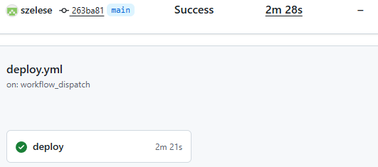
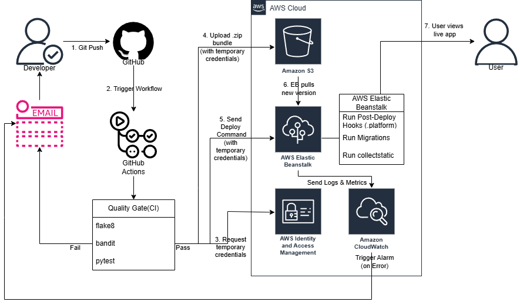

# CI/CD pipeline with GitHub Actions and AWS Elastic Beanstalk

This repository was developed as part of my Bachelor’s thesis. It demonstrates how to set up a CI/CD pipeline using **GitHub Actions** and **AWS Elastic Beanstalk** for deploying a Django application.

[](https://github.com/szelese/ci-cd-gha-aws/actions/workflows/deploy.yml)

**1. The Successful CI/CD Pipeline (GitHub Actions):**
Below: the successful run of the `deploy.yml` workflow, including all build, test, and deploy steps.
[](docs/images/deploy_success.png)

**2. The Deployed Application (AWS Elastic Beanstalk):**
This image shows the live Django application. You can visit the deployed site directly at the link below:

### [**http://mysite-env-2.eba-thgvigmp.eu-north-1.elasticbeanstalk.com/**](http://mysite-env-2.eba-thgvigmp.eu-north-1.elasticbeanstalk.com/)
Demo site may be suspended for cost reasons.


---
## 🎓 Thesis Context & Deep Dive Analysis

This repository serves as the practical implementation for my engineering thesis.

While this `README` summarizes the "how," the full academic paper provides the deep "why," including:
* **DORA Metrics:** Detailed analysis of the "Elite" performance across all four key DORA metrics (Lead Time, Deployment Frequency, Change Fail Rate, and MTTR).
* **ROI Analysis:** The full cost-benefit calculation ($21,600 savings vs. $108 cost /year).
* **Troubleshooting Logs:** The complete "lessons learned," including the IAM/CloudTrail debugging, the `Degraded` Health Check fix, and the GDPR incident response.
* **Load Testing:** The full results from the Locust tests that proved horizontal auto-scaling.

You can download the full PDF documents here:

* [🇭🇺 **Szakdolgozat (Magyar Nyelvű PDF)**](docs/thesis_hu.pdf)
* [🇬🇧 **English Version (PDF)** — Translation in progress]()

## 🛠️ Architecture & Workflow

This diagram illustrates the complete CI/CD process from a developer pushing code to the application being live on AWS.



**The workflow executes the following steps:**

1.  **Trigger:** A developer pushes a commit to the `main` branch, which automatically triggers the GitHub Actions workflow.
2.  **CI Quality Gate:** The code runs through a series of automated checks.
    * **Linting (`flake8`):** Checks code style and syntax.
    * **Security (`bandit`):** Scans for common security vulnerabilities.
    * **Testing (`pytest`):** Runs the full suite of unit tests.
    * If any check **fails**, the pipeline stops and alerts the developer via email.
3.  **Assume AWS Role (OIDC):** If the Quality Gate **passes**, the workflow securely requests temporary credentials from AWS IAM using OpenID Connect (OIDC). No static keys are used.
4.  **Package & Upload:** The workflow creates a `.zip` bundle of the Django application and uploads it to an **Amazon S3** bucket using its temporary credentials.
5.  **Trigger Deploy:** GitHub Actions sends a deploy command to **AWS Elastic Beanstalk**, pointing it to the new application bundle in S3.
6.  **EB Pull & Deploy:** Elastic Beanstalk pulls the `.zip` bundle from S3 and begins the deployment.
7.  **Run Post-Deploy Hooks:** Once the new code is in place, Elastic Beanstalk automatically runs the scripts in the `.platform/hooks/postdeploy/` directory to:
    * Run database migrations (`manage.py migrate`).
    * Collect static files (`manage.py collectstatic`).
8.  **Monitor & Alert:** **Amazon CloudWatch** monitors the health of the live environment. If any errors or alarms are triggered (e.g., the environment turns "Red"), it sends an alert to the developer via email, closing the feedback loop.
9.  **Live:** The deployment finishes, and the user can view the new, updated version of the application.

---

## 🛠️ Local Setup
To run this project locally, you will need **Python 3.11** and **Git** installed.

1.  **Clone the Repository:**
    ```bash
    git clone https://github.com/szelese/ci-cd-gha-aws.git
    cd ci-cd-gha-aws
    ```

2.  **Create and Activate a Virtual Environment:**
    *This isolates the project's dependencies from your system.*
    ```bash
    # Create the environment
    python -m venv .venv

    # Activate it (Windows - Git Bash / PowerShell)
    source .venv/Scripts/activate

    # Activate it (macOS / Linux)
    # source .venv/bin/activate
    ```

3.  **Install Dependencies:**
    *Install all required packages from the requirements file.*
    ```bash
    pip install -r requirements.txt
    ```

4.  **Run Database Migrations:**
    *This sets up the initial Django database schema (a local `db.sqlite3` file will be created).*
    ```bash
    python manage.py migrate
    ```

5.  **Run the Local Server:**
    ```bash
    python manage.py runserver
    ```

6.  **View the Application:**
    Open your browser and navigate to **`http://127.0.0.1:8000/`**. You should see the application running.

---

## ☁️ Deployment & Configuration (AWS & GitHub)
This project is configured for automated, secure deployment using GitHub Actions (OIDC) and AWS Elastic Beanstalk. To deploy this project to your own AWS account, you need to set up two things:

* **AWS IAM Role:** An IAM role that GitHub Actions can securely assume using OIDC.
* **GitHub Secrets:** Repository secrets that the workflow files (`ci.yml`, `deploy.yml`) will use.

### 1. AWS Setup (IAM OIDC Role)
You do not need to store static AWS `Access_Key_ID` or `Secret_Access_Key` as secrets. This repository uses **OpenID Connect (OIDC)** to securely request temporary credentials from AWS at runtime.

You need to create the following in your AWS account:

1.  **An Elastic Beanstalk Environment:** Create a new Elastic Beanstalk application and an environment (e.g., `mysite-env-2`) running on the **Python 3.11** platform.
2.  **An OIDC Identity Provider:** In the IAM console, create an Identity Provider for `token.actions.githubusercontent.com` with the audience `sts.amazonaws.com`.
3.  **An IAM Role:** Create a new IAM Role (e.g., `GitHubOIDC-EBDeploy`) that trusts the OIDC provider (step 2). This role's **Trust Policy** should be limited to your specific repository (`szelese/ci-cd-gha-aws`) and `main` branch.
4.  **Attach Permissions:** Attach a minimal permission policy to this role. This policy must allow the role to perform the actions defined in the `deploy.yml` workflow, such as:
    * `s3:PutObject` (to upload the `.zip` bundle)
    * `elasticbeanstalk:CreateApplicationVersion`
    * `elasticbeanstalk:UpdateEnvironment`
    * *(A detailed, step-by-step guide on finding these minimal permissions is detailed in steps 78-82 of the project's thesis appendix.)*

### 2. GitHub Secrets Setup
Go to your repository's `Settings > Secrets and variables > Actions` and add the following repository secrets:

* `AWS_REGION`: The AWS region where your Elastic Beanstalk environment is located (e.g., `eu-north-1`).
* `APP_NAME`: The name of your Elastic Beanstalk *application* (e.g., `mysite`).
* `ENV_NAME`: The name of your Elastic Beanstalk *environment* (e.g., `Mysite-env-2`).
* `AWS_IAM_ROLE_ARN`: The **ARN** of the IAM role you created in the previous step (e.g., `arn:aws:iam::123456789:role/GitHubOIDC-EBDeploy`).
* `DJANGO_SECRET_KEY`: A new, strong, randomly generated Django secret key for your application.

Once these steps are complete, any push to the `main` branch will automatically trigger the `deploy.yml` workflow, which will assume the IAM role via OIDC and deploy the application to your Elastic Beanstalk environment.

---

## 🛠️ Technologies
- GitHub Actions
- AWS Elastic Beanstalk
- Python / Django

---

## ✍️ Author
Ervin Széles

---
## ⚖️ Legal Notice

This repository and its contents were created as part of a Bachelor’s thesis project at Gábor Dénes University.  
They are shared **for educational and demonstration purposes only**.

You are welcome to view and learn from this project,  
but **re-use or modification requires prior permission from the author.**

The author **assumes no responsibility** for any issues, damages, or errors resulting from the use of these materials.

© 2025 Ervin Széles
